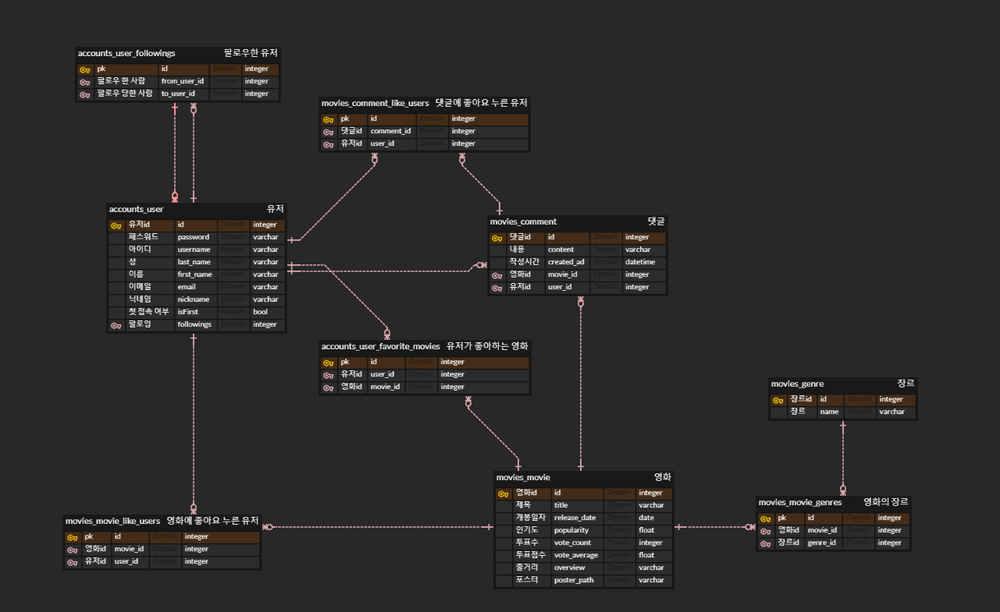

# final-pjt

## 1. 팀원 정보 및 역할 분담 내역
### 팀장 김기윤
#### back
- 로그인, 회원가입, 프로필 페이지, 최초 로그인 시 좋아하는 영화 선택 등 회원 관련 기능 구현
- 영화 장르별 조회, 검색 기능, 좋아할만한 영화, 가장 많이 선택된 영화 등 영화 조회 기능 구현
- 프로필 페이지에서 유저 팔로우 기능, 팔로잉 팔로워 목록 가져오기, 작성한 댓글 목록, 좋아요한 댓글 목록, 좋아요한 영화 목록 가져오기 기능 구현
- 디테일 페이지 영화 좋아요, 댓글 좋아요 기능, 예고편 보여주는 기능 구현
  
#### front
- 검색 결과 페이지 제작
- 장르별 영화 페이지 제작
- 프로필 페이지 제작
- 로그인, 회원가입 페이지 제작
- 팔로잉, 팔로워 목록 페이지 제작
  
### 팀원 오성훈
#### back
- 메인페이지 - tmdb API를 이용하여 top rated movie, 상영중인 영화, 개봉 예정 영화 가져오기
- 디테일 페이지 - 영화 디테일 정보, 비슷한 영화 목록, 배우 목록 가져오기, 댓글 CURD 구현
- 데이터베이스 ERD 제작

#### front
- 메인페이지 제작
- 디테일페이지 제작

## 2. 목표 서비스 구현 및 실제 구현 정도
### 목표 서비스 구현
- 로그인, 회원가입, 로그아웃, refresh token, oauth 소셜 로그인
- 다양한 기준으로 영화 목록 조회, 영화 좋아요
- 댓글 CRUD, 댓글 좋아요, 대댓글 CRUD, 대댓글 좋아요
- 프로필 페이지, 팔로우 기능, 프로필 이미지 CRUD
- 영화 검색 기능
- 영화 배우 프로필, 필모그래피

### 실제 서비스 구현
- ~~로그인, 회원가입, 로그아웃, refresh token~~
- ~~다양한 기준으로 영화 목록 조회, 영화 좋아요~~
- ~~댓글 CRUD, 댓글 좋아요~~
- ~~프로필 페이지, 팔로우 기능~~
- ~~영화 검색 기능~~
- __프로필 페이지 이미지 CRUD__
- __OAUTH 소셜 로그인__
- __대댓글 CRUD, 대댓글 좋아요__
- __영화 배우 프로필, 필모그래피__

## 3. 데이터베이스 모델링 (ERD)

## 4. 영화 추천 알고리즘에 대한 기술적 설명
### 검색 알고리즘

공백을 기준으로 split()하여 검색 키워드와 정확히 일치하는 영화는 메인으로 보여주고 split한 단어가 영화 제목이나 줄거리에 포함되어 있으면 하위 리스트로 출력해주도록 구현하였습니다.
___
### 좋아할만한 영화 추천 알고리즘

먼저 회원가입을 하고 최초 로그인 시 로그인 결과 response에 isFirst라는 boolean값을 보내서 데이터베이스에 있는 영화 중 좋아하는 영화를 3개에서 10개 사이로 선택하도록 하였습니다. 

그 다음 서버에서 선택한 영화와 비슷한 장르의 영화를 추천해주도록 구현하였습니다.
___
### 가장 많이 선택한 영화 추천 알고리즘

최초 로그인 시 유저들이 선택한 영화 중 가장 많이 선택된 영화를 내림차순으로 정렬하여 top 10개만 보여주도록 구현하였습니다.
___
### 비슷한 영화 조회 알고리즘

지금 보고 있는 영화의 장르와 완전히 같거나, 그 장르들을 모두 포함하고 있는 영화들을 가져옴. 영화의 개수가 너무 많을 경우 20개만 선별했는데 비슷한 영화 목록이 매번 달라질 수 있도록 random을 사용함

## 5. 서비스 대표 기능에 대한 설명
### 1) refresh token
기술 적용 배경

JWT 토큰은 브라우저의 쿠키나 스토리지에 저장되기 때문에 탈취 당해도 서버에서 삭제할 수가 없어 해킹당했을때 어떠한 조취도 취할수가 없습니다. 그렇기 때문에 유효기간을 짧게 하여 탈취 당해도 유효기간이 지나 탈취된 토큰을 사용할 수 없도록 하고 비교적 유효기간이 긴 refresh token을 발급하여 access token이 만료됐을 경우 refresh token으로 재발급 받을 수 있도록 구현하였습니다.

테스트를 위해 access token의 유효기간을 10초로 설정

10초가 지난뒤 댓글을 작성했을 때 401 Unauthorized 에러가 발생하지만 바로 refresh 토큰으로 새로운 access token을 발급받아 댓글이 작성된 것을 확인할 수 있었습니다.

### 2) 좋아하는 영화 선택

먼저 회원가입을 하고 최초 로그인 시 로그인 결과 response에 isFirst라는 boolean값을 보내서 데이터베이스에 있는 영화 중 좋아하는 영화를 3개에서 10개 사이로 선택하도록 하였습니다. 

이때 navbar를 없애서 다른 페이지로는 이동할 수 없도록 구현하였고 영화 목록은 vue-infinite-loading 라이브러리로 무한스크롤을 구현하여 처음에 40개의 영화목록을 가져오고 스크롤을 끝까지 내리면 다음 영화 목록 40개를 가져오도록 구현하였습니다.

### 3) 커뮤니티
#### 영화 좋아요

#### 댓글 좋아요

#### 프로필 페이지

유저가 좋아요한 영화나 댓글 목록을 프로필 페이지에서 확인할 수 있도록 하여 유저들의 취향과 나와 같은 취향의 사람들은 어떤영화를 좋아하는지 확인할 수 있도록 구현하였습니다.

## 6. 기타 (느낀 점, 후기 등)
프로젝트를 진행하면서 프로젝트 규모가 점점 커지고 기획, 설계단계에서 계획하지 않았던 기능들을 추가하다보니 코드를 유지 보수하기가 힘들어졌고 코드의 결합도가 높아져 코드를 수정했을때 다른 코드에 영향을 주는 경우가 많아졌습니다. 그리고 브랜치를 생성하여 개발영역을 나눠서 구현했음에도 컨플릭트가 발생하여 협업하는데 어려움이 있었습니다.